# Phase 1 — Lab Setup

## Objective
Build an isolated penetration testing lab using two virtual machines — one as the target running DVWA, and one as the attacker running Kali Linux.

---

## Lab Architecture

┌─────────────────────┐         ┌─────────────────────┐

│    Kali-Attacker    │◄───────►│    DVWA-Server      │

│    Kali Linux       │         │    Ubuntu 22.04      │

│    192.168.100.x    │         │    192.168.100.129   │

└─────────────────────┘         └─────────────────────┘

Attacker                        Target

VMware Host-Only Network (Isolated)

---

## Environment Details

| Component | Details |
|---|---|
| Virtualization | VMware Workstation |
| Network Type | Host-Only (fully isolated) |
| Target OS | Ubuntu Server 22.04 LTS |
| Attacker OS | Kali Linux 2026 |
| Target IP | 192.168.100.129 |
| Web Application | DVWA (Damn Vulnerable Web Application) |

---

## Target Machine — DVWA-Server

### Specs
| Setting | Value |
|---|---|
| RAM | 2048 MB |
| CPU | 2 cores |
| Disk | 20 GB |
| Network | Host-Only |

### Software Stack
| Software | Version | Purpose |
|---|---|---|
| Apache | 2.4.66 | Web server |
| MariaDB | 11.8.6 | Database |
| PHP | 8.5.4 | Backend language |
| OpenSSH | 10.2p1 | Remote access |
| DVWA | Latest | Vulnerable web app |

---

## Attacker Machine — Kali-Attacker

### Specs
| Setting | Value |
|---|---|
| RAM | 2048 MB |
| CPU | 2 cores |
| Disk | 30 GB |
| Network | Host-Only |

---

## Installation Steps

### 1. Install Dependencies on Ubuntu Server
```bash
sudo apt install apache2 -y
sudo apt install mariadb-server -y
sudo apt install php php-mysqli php-gd libapache2-mod-php -y
sudo apt install git -y
sudo apt install openssh-server -y
```

### 2. Download DVWA
```bash
sudo git clone https://github.com/digininja/DVWA.git /var/www/html/dvwa
sudo chown -R www-data:www-data /var/www/html/dvwa
sudo chmod -R 755 /var/www/html/dvwa
```

### 3. Configure Database
```bash
sudo mariadb-secure-installation
sudo mysql -u root -p
```
```sql
CREATE DATABASE dvwa;
CREATE USER 'dvwa'@'localhost' IDENTIFIED BY 'dvwa123';
GRANT ALL PRIVILEGES ON dvwa.* TO 'dvwa'@'localhost';
FLUSH PRIVILEGES;
EXIT;
```

### 4. Configure PHP
```bash
sudo nano /etc/php/*/apache2/php.ini
# Set: allow_url_include = On
sudo systemctl restart apache2
sudo a2enmod rewrite
sudo systemctl restart apache2
```

### 5. Initialize DVWA Database
- Navigate to `http://192.168.100.129/dvwa/setup.php`
- Click **Create / Reset Database**
- Login with `admin` / `password`

---

## Verification

| Check | Status |
|---|---|
| SSH running | ✅ Active |
| Apache running | ✅ Active |
| MariaDB running | ✅ Active |
| DVWA accessible | ✅ http://192.168.100.129/dvwa |
| Kali can ping Ubuntu | ✅ Verified |

---

## Screenshots

### 1. Network Configuration
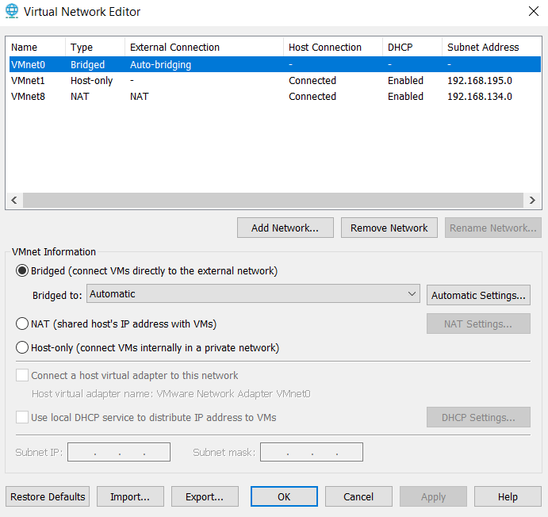

### 2. Network Configuration Updated
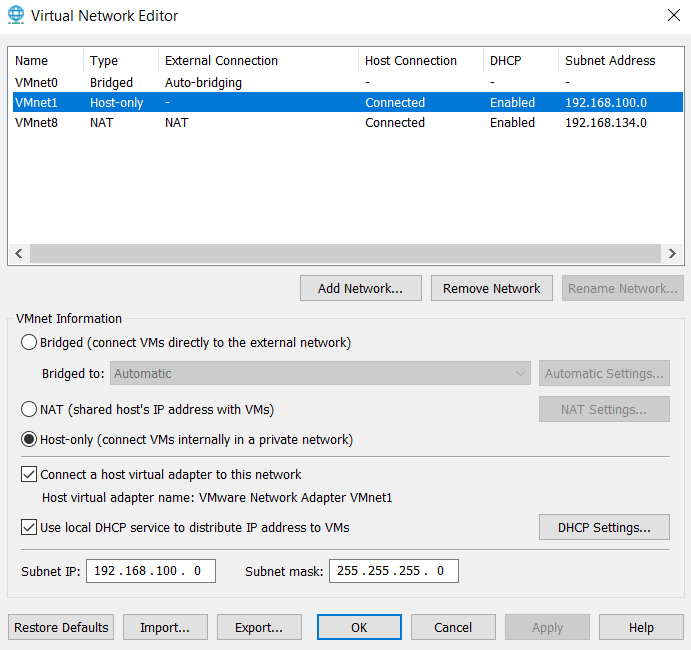

### 3. Ubuntu Server Login Prompt
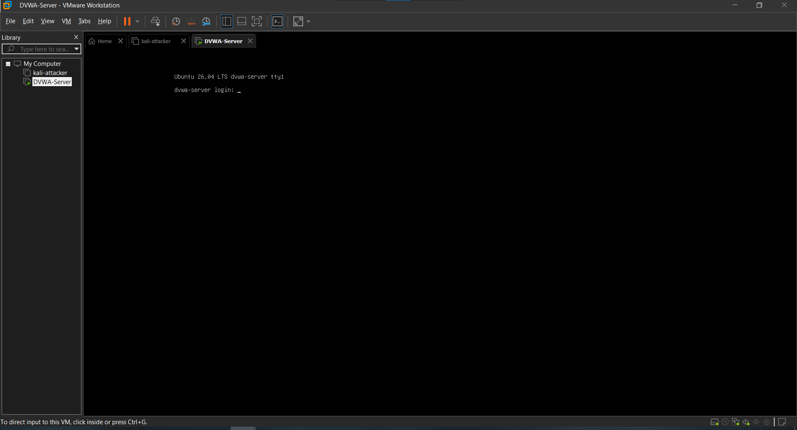

### 4. First Login
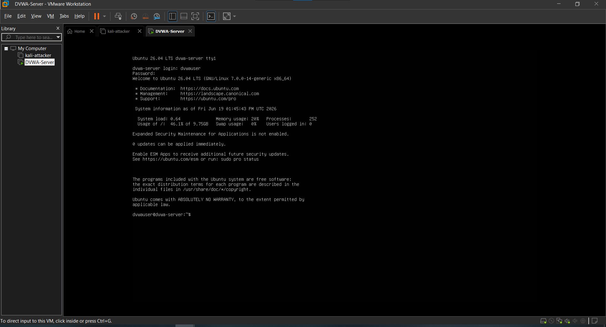

### 5. SSH Active
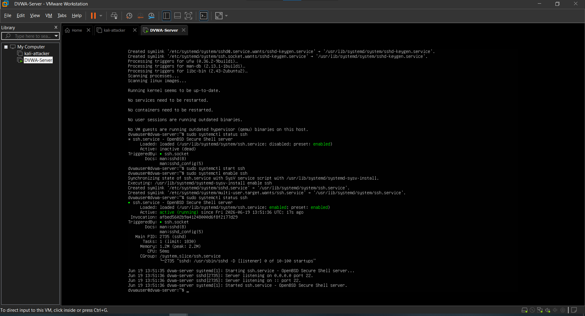

### 6. Database Configured
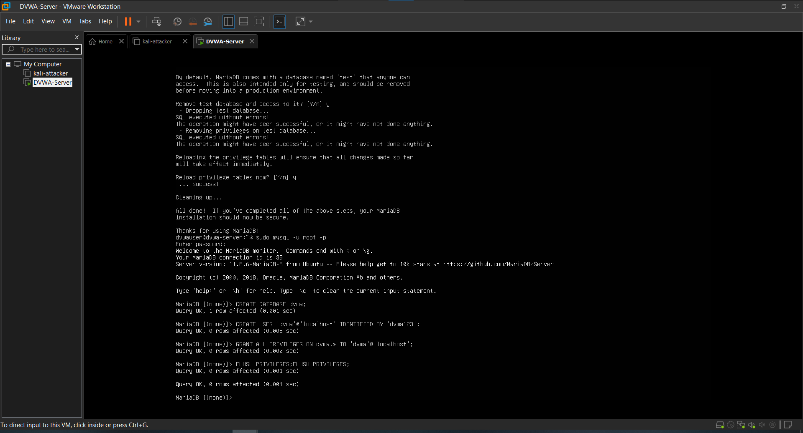

### 7. Apache Active
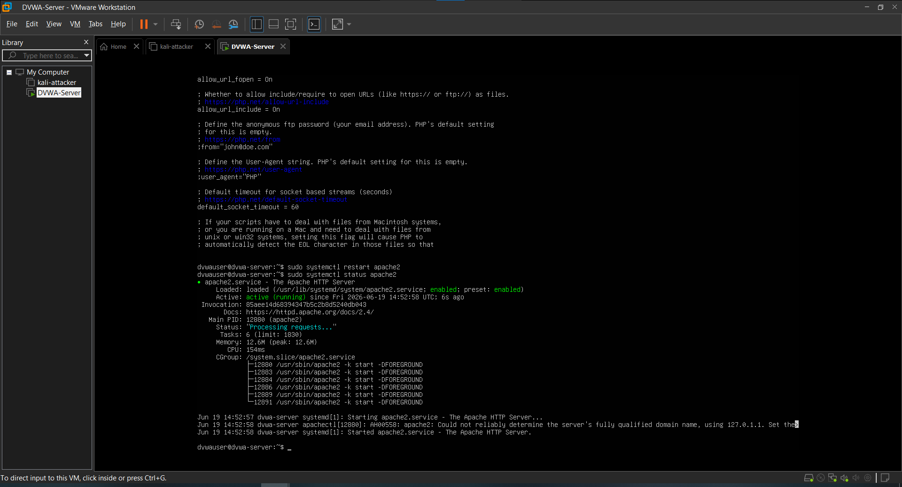

### 8. Ping from Kali to Ubuntu
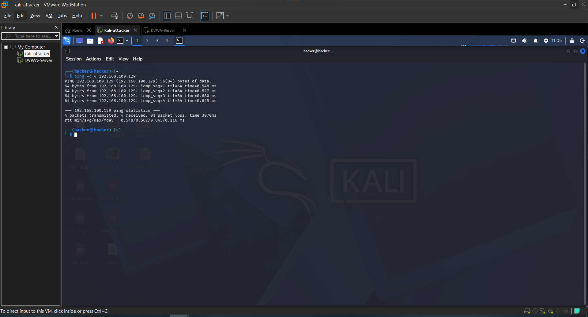

### 9. DVWA Setup Page
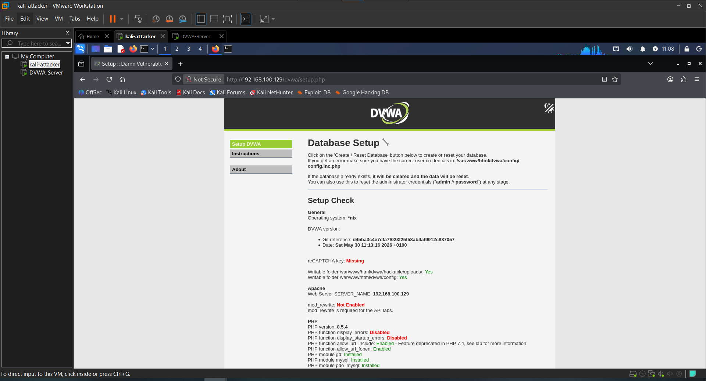

### 10. DVWA Setup Checks Passing
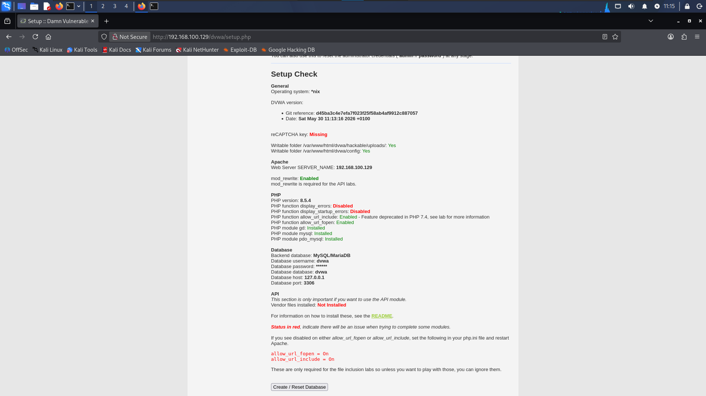

### 11. DVWA Login Page
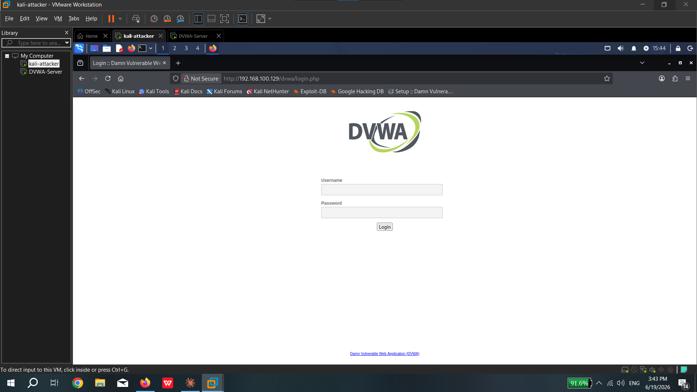

### 12. DVWA Main Page
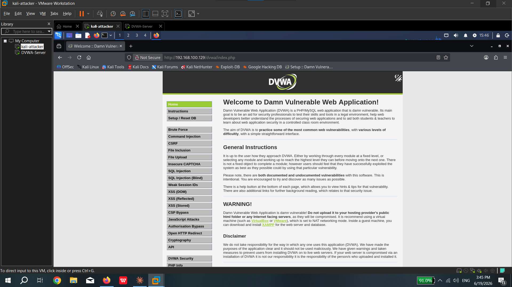

---

## Next Phase
[Phase 2 — Reconnaissance](../02-Recon/)
