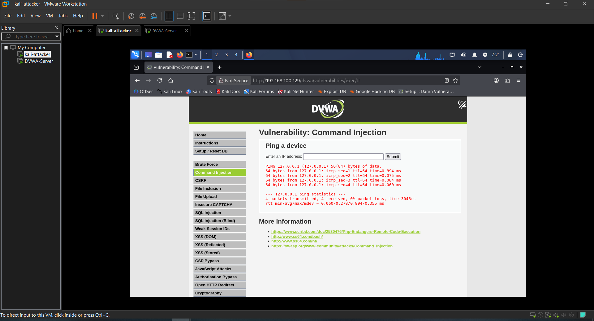
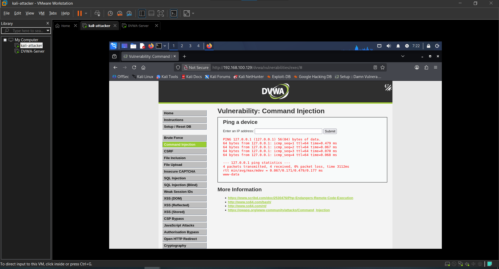
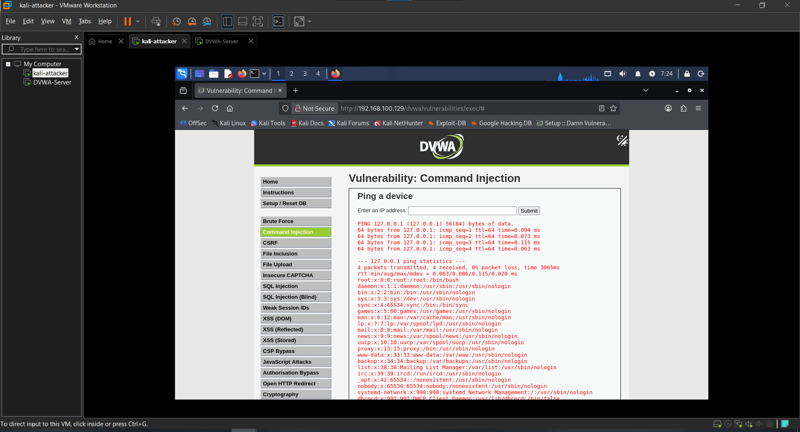
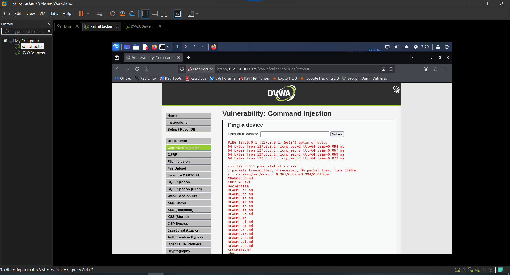

# Attack 2 — Command Injection

## What is it?
Command injection tricks the application into executing operating system commands by injecting them into an input field that is passed directly to the server's shell. This gives the attacker direct access to the underlying operating system.

---

## Target
- **URL**: http://192.168.100.129/dvwa/vulnerabilities/exec/
- **Tool**: Manual
- **Security Level**: Low

---

## Steps

### 1. Test normal functionality
Entered a valid IP address to confirm normal behavior:

127.0.0.1

The application returned a normal ping result.

### 2. Inject whoami command

127.0.0.1 && whoami

**Result**: `www-data` — confirmed the web server is running as www-data user.

### 3. Read sensitive system file

127.0.0.1 && cat /etc/passwd

**Result**: Full contents of /etc/passwd returned — all system user accounts exposed.

### 4. Fingerprint the kernel

127.0.0.1 && uname -a

**Result**: Full kernel version and OS build information revealed.

### 5. Browse web server files

127.0.0.1 && ls /var/www/html/dvwa

**Result**: Full DVWA directory listing returned — attacker can browse the entire web server file structure.

---

## Result
Full operating system command execution achieved through a web input field. The server executed every injected command as the www-data user.

---

## Impact
- Read sensitive system files (/etc/passwd)
- Identify all system user accounts for further attacks
- Fingerprint the kernel for known exploit research
- Browse the entire web server file structure
- In a real scenario this could lead to a full reverse shell

---

## Remediation
- Never pass user input directly to system commands
- Use input validation and whitelist allowed characters
- Implement a Web Application Firewall (WAF)
- Run the web server with minimal privileges
- Disable functions like exec(), shell_exec() in PHP

---

## Screenshots

### 1. Normal ping result

### 2. whoami injection

### 3. /etc/passwd exposed

### 4. Kernel fingerprint

### 5. Directory listing

---

## Next Attack
[Attack 3 — SQL Injection](../03-SQL-Injection/)
