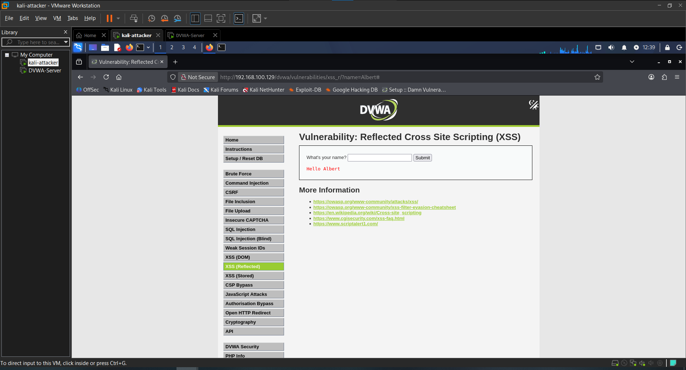
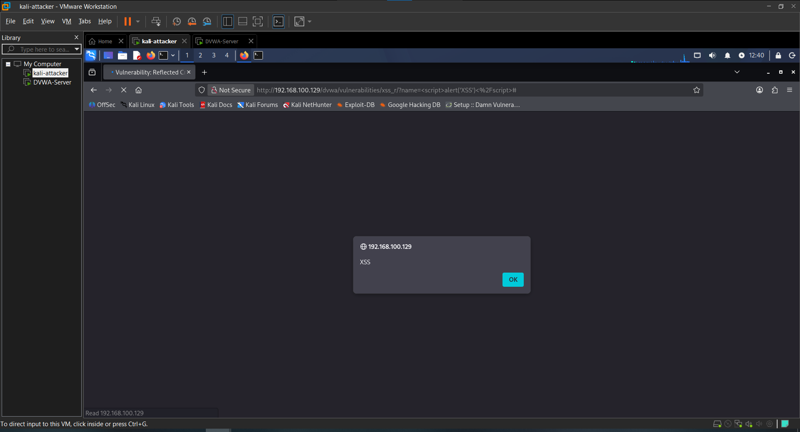
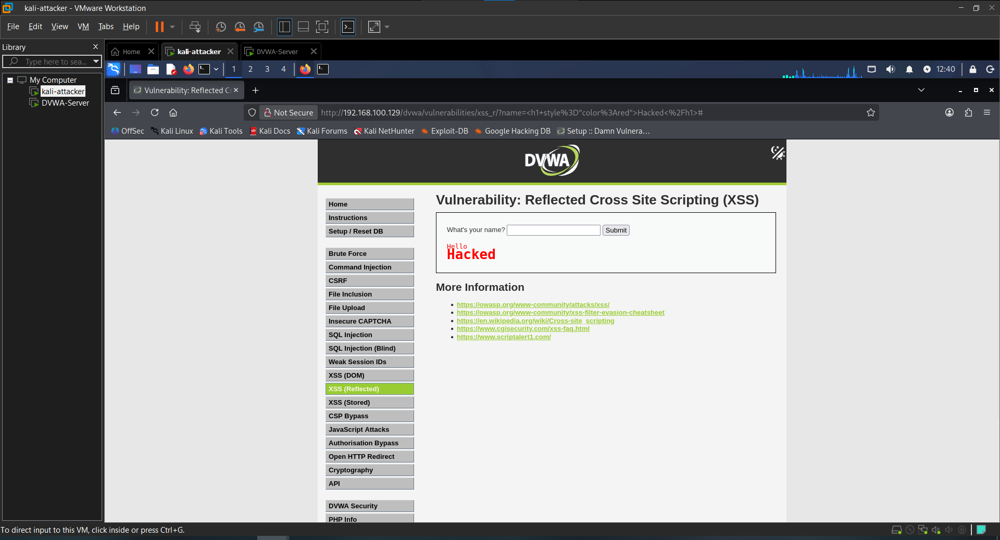

# Attack 6 — XSS Reflected

## What is it?
Cross-Site Scripting (XSS) occurs when a web application takes user input and reflects it back in the page without sanitization, allowing an attacker to inject malicious JavaScript or HTML. In a Reflected XSS attack, the payload is embedded in a URL — when a victim clicks the crafted link, the script executes in their browser under the site's trust context, giving the attacker access to cookies, session tokens, and more.

---

## Target
- **URL**: http://192.168.100.129/dvwa/vulnerabilities/xss_r/
- **Tool**: Manual
- **Security Level**: Low

---

## Steps

### 1. Test normal functionality
Entered a name in the input field to confirm how the application handles input:
```
Albert
```
The page reflected the input directly back:
```
Hello Albert
```
This confirms user input is embedded into the page response with no sanitization.

### 2. Inject a basic script
Entered a JavaScript payload into the input field:
```html
<script>alert('XSS')</script>
```
**Result**: A JavaScript alert popup fired in the browser — confirmed the application executes injected scripts with no filtering at Low security level.

### 3. Steal the session cookie
Injected a payload targeting the browser's cookie storage:
```html
<script>alert(document.cookie)</script>
```
**Result**: The alert displayed the live session cookie including `PHPSESSID` and `security` values. In a real attack, this payload would silently send the cookie to an attacker-controlled server, allowing full session hijacking without knowing the victim's password.

### 4. Inject malicious HTML
Entered an HTML injection payload to demonstrate the browser renders arbitrary markup:
```html
<h1 style="color:red">Hacked</h1>
```
**Result**: A large red "Hacked" heading rendered on the page — confirming the application reflects raw HTML with no encoding, not just JavaScript.

---

## Result
All injected payloads executed successfully with zero filtering. The application reflects user input directly into the HTML response, allowing arbitrary JavaScript and HTML injection through a crafted input or URL.

---

## Impact
- JavaScript execution in the victim's browser under the site's trusted origin
- Session cookie theft leading to account takeover without credentials
- Credential harvesting via injected fake login forms
- Redirection of victims to malicious external sites
- In a real scenario, the payload URL is sent to a victim — no interaction beyond clicking a link is required

---

## Remediation
- Encode all user input before reflecting it into HTML output (e.g. convert `<` to `&lt;`)
- Use a Content Security Policy (CSP) header to restrict script execution
- Validate and whitelist expected input on the server side
- Use modern frameworks that auto-escape output by default
- Set the `HttpOnly` flag on session cookies to prevent JavaScript access

---

## Screenshots

### 1. Normal input reflected


### 2. Script alert fired


### 3. Session cookie exposed


### 4. HTML injection rendered


---

## Next Attack
[Attack 7 — XSS Stored](../07-XSS-Stored/)
