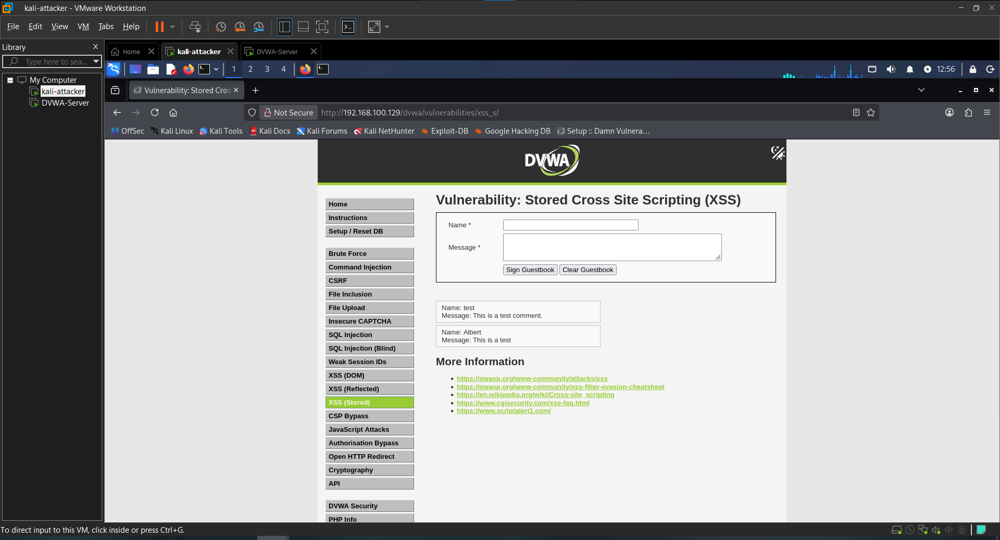
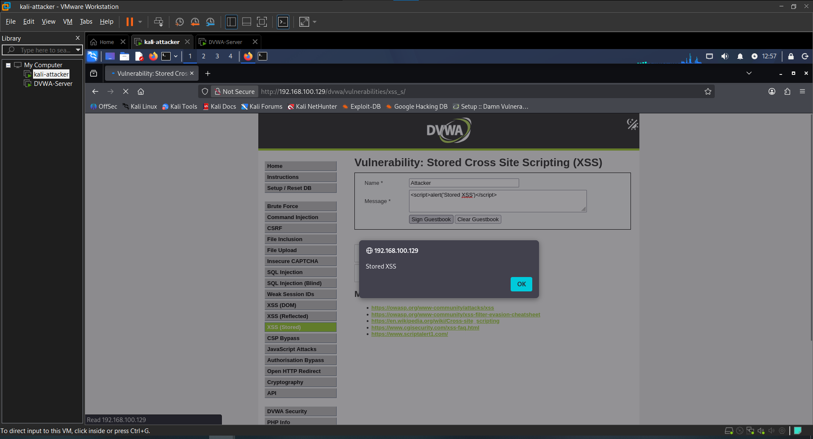
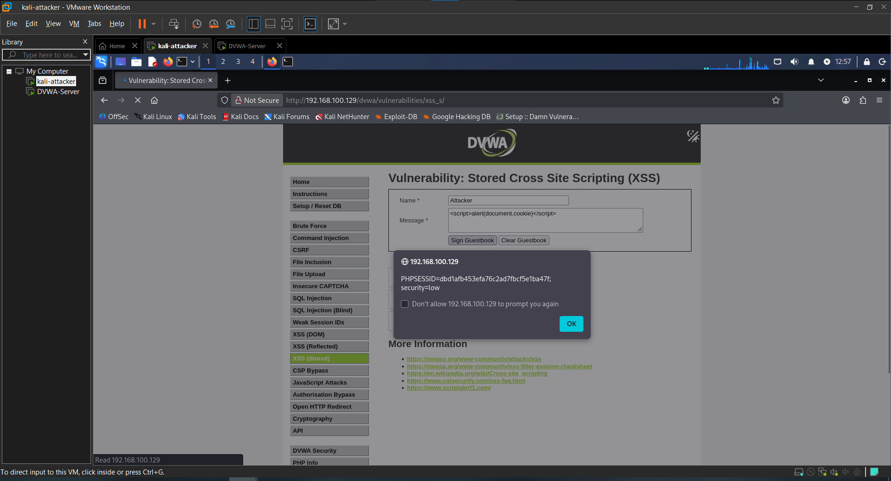

# Attack 7 — XSS Stored

## What is it?
Stored Cross-Site Scripting (XSS) is a more dangerous variant of XSS where the malicious payload is saved permanently in the application's database. Unlike Reflected XSS which requires a victim to click a crafted link, Stored XSS fires automatically for every user who visits the affected page — making it significantly more impactful in a real attack scenario.

---

## Target
- **URL**: http://192.168.100.129/dvwa/vulnerabilities/xss_s/
- **Tool**: Manual
- **Security Level**: Low

---

## Steps

### 1. Test normal functionality
Filled in the guestbook form with legitimate input to confirm normal behavior:
- **Name**: Albert
- **Message**: Hello this is a test

The entry was saved and displayed on the page normally, confirming input is stored in the database and rendered back to all visitors.

### 2. Inject a stored script
Submitted a JavaScript payload through the guestbook form:
- **Name**: Attacker
- **Message**:
```html
<script>alert('Stored XSS')</script>
```
**Result**: The alert popup fired immediately on page load. The payload is now permanently stored in the database — every user who visits the guestbook page will trigger the alert automatically with no further attacker interaction required.

### 3. Steal the session cookie
Submitted a second payload targeting session cookies:
- **Name**: Attacker
- **Message**:
```html
<script>alert(document.cookie)</script>
```
**Result**: The alert displayed the live session cookie including `PHPSESSID` and `security` values. In a real attack, this payload would silently exfiltrate the cookie of every visitor to an attacker-controlled server, enabling mass session hijacking.

---

## Result
Both payloads were stored in the database and executed automatically on every page load with zero filtering. No crafted link or victim interaction is required beyond simply visiting the guestbook page.

---

## Impact
- Payload persists in the database and attacks every visitor automatically
- Mass session cookie theft from all users who visit the page
- No malicious link needed — normal site navigation triggers the attack
- Admin accounts can be compromised if an administrator views the page
- In a real scenario this leads to full account takeover at scale

---

## Remediation
- Sanitize and encode all user input before storing it in the database
- Encode output when rendering stored content back to the page
- Implement a Content Security Policy (CSP) header to restrict script execution
- Set the `HttpOnly` flag on session cookies to block JavaScript access
- Enforce input length limits to reduce payload space
- Use modern frameworks that auto-escape rendered content by default

---

## Screenshots

### 1. Normal guestbook entry


### 2. Stored script alert fired


### 3. Session cookie exposed


---

## Next Attack
[Attack 8 — CSRF](../08-CSRF/)
