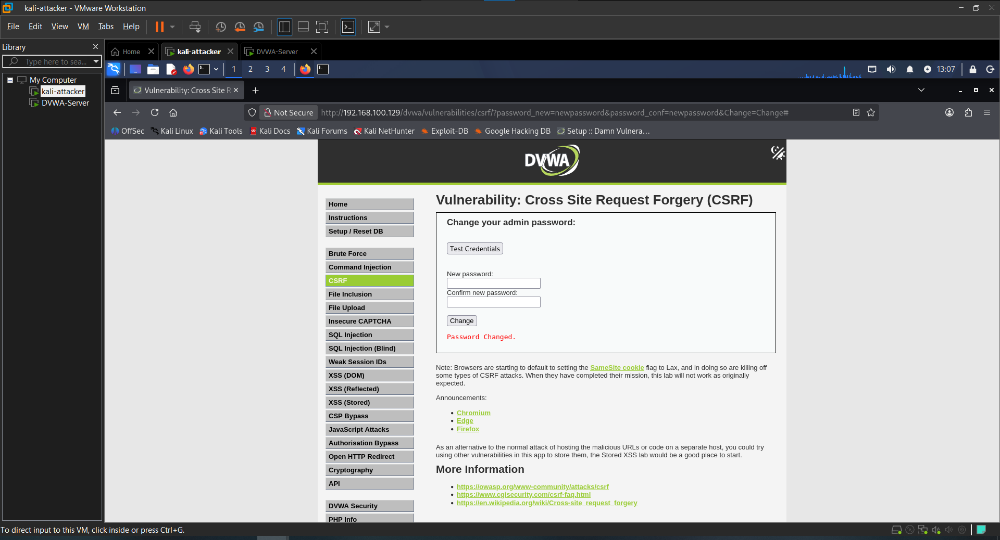
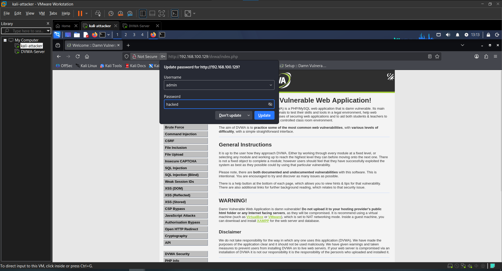

# Attack 8 — CSRF (Cross-Site Request Forgery)

## What is it?
Cross-Site Request Forgery (CSRF) tricks the victim's browser into making an unwanted request to the application using their existing session — without them knowing. In DVWA, the target is changing the admin password silently by exploiting a GET request that lacks any anti-CSRF protection.

---

## Target
- **URL**: http://192.168.100.129/dvwa/vulnerabilities/csrf/
- **Tool**: Manual
- **Security Level**: Low

---

## Steps

### 1. Test normal functionality
Navigated to the CSRF page and entered a new password normally to confirm the form works:

newpassword

The page confirmed the password was successfully changed.

### 2. Inspect the request
Changed the password to `test123` and observed the URL after submission. DVWA sends the password change as a GET request:

http://192.168.100.129/dvwa/vulnerabilities/csrf/?password_new=test123&password_conf=test123&Change=Change

**Result**: The password change parameters are exposed in the URL — sensitive actions should never use GET requests, and there is no CSRF token protecting this form.

### 3. Craft a malicious link
Built a URL that changes the password to `hacked` silently:

http://192.168.100.129/dvwa/vulnerabilities/csrf/?password_new=hacked&password_conf=hacked&Change=Change

Pasted this URL directly into the browser while logged in as admin.
**Result**: The password changed with no form interaction — the application processed the GET request as a legitimate password change.

### 4. Verify the attack worked
Logged out and attempted to log back in with the new password `hacked`.
**Result**: Login succeeded — confirmed the password was successfully changed via the crafted URL.

---

## Result
Successfully changed the admin password from the original to `hacked` by crafting a single GET request URL. The victim only needed to click the link while logged into DVWA — no additional interaction or consent was required.

---

## Impact
- Account takeover — attacker can change user passwords without consent
- No user interaction required beyond clicking a link
- GET-based CSRF is trivial to exploit — just paste a URL or embed it as an image tag
- No CSRF tokens makes the application completely vulnerable
- Combined with phishing or XSS, this attack can be delivered silently at scale

---

## Remediation
- Use POST instead of GET for all state-changing operations
- Implement CSRF tokens — unique, unpredictable tokens tied to the user's session
- Set the SameSite cookie attribute to `Strict` or `Lax` to restrict cross-origin requests
- Require re-authentication for sensitive actions like password changes
- Add CAPTCHA for critical operations to prevent automated attacks

---

## Screenshots

### 1. Normal password change form

### 2. GET request URL with parameters

### 3. CSRF attack successful

### 4. Login verification with new password

---

## Next Attack
[Back to Brute Force](../01-Brute-Force/)
